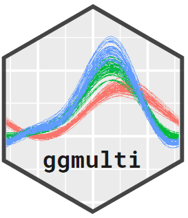
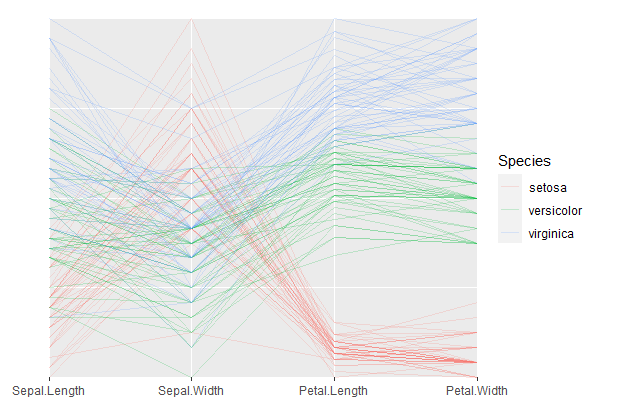
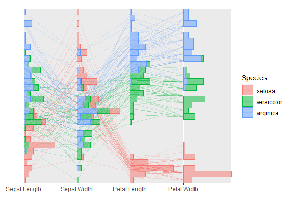
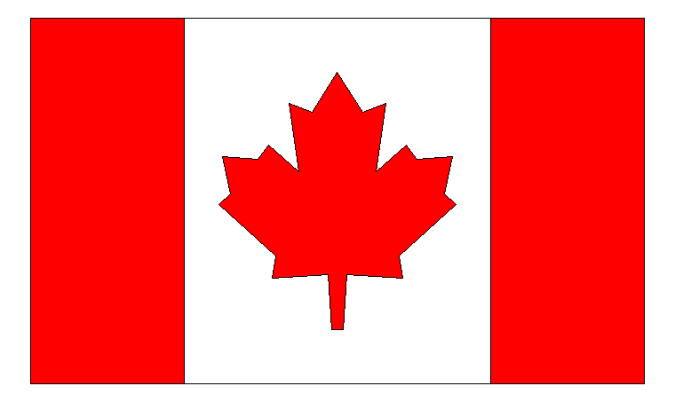
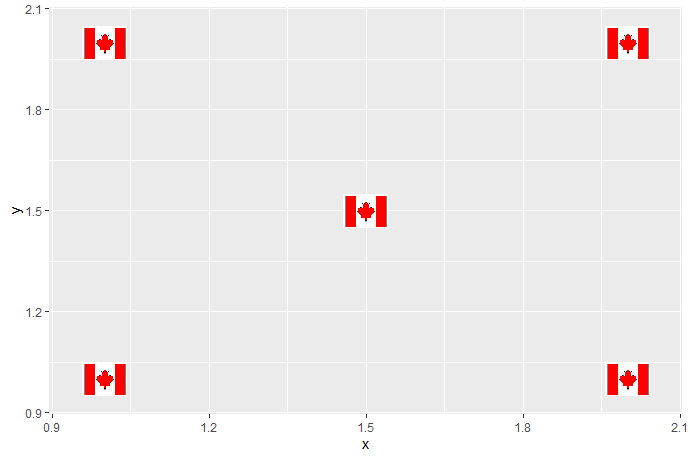
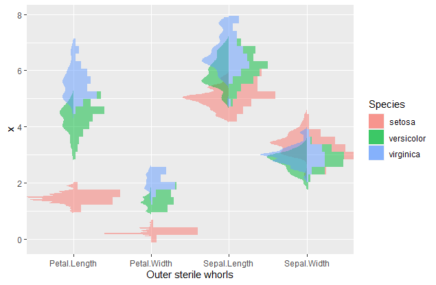

# ggmulti  

[](https://travis-ci.com/great-northern-diver/ggmulti.svg?branch=main)
[](https://codecov.io/gh/great-northern-diver/ggmulti?branch=main)
[](https://cran.r-project.org/web/packages/ggmulti/index.html)


It provides materials (i.e. serialaxes objects) to visualize high dimensional data in `ggplot`.

The development version of `ggmulti` can be accessed directly from github repo

```
remotes::install_github("https://github.com/great-northern-diver/ggmulti")
```

Documentation: https://great-northern-diver.github.io/ggmulti/

## Introduction

Package `ggmulti` extends the `ggplot2`  package to provide some high dimensional visualization functionality, such as

* Serialaxes coordinates (i.e., parallel or  radial axis systems)

* General glyphs (e.g., polygons, images) to appear a scatterplot. 

* "More general" `geom_histogram` and `geom_density` to allow them to appear on serial axes.

### Serialaxes Coordinates

Parallel coordinates

```
library(ggmulti)
p <- ggplot(iris, 
            mapping = aes(Sepal.Length = Sepal.Length,
                          Sepal.Width = Sepal.Width,
                          Petal.Length = Petal.Length,
                          Petal.Width = Petal.Width,
                          colour = Species)) +
       geom_path(alpha = 0.2) +
       coord_serialaxes()
p
```



We can also construct a radar plot by setting `axes.layout = "radial"` in `coord_serialaxes`. In addition, we can add histogram layer on top

```
p + 
  geom_histogram(mapping = aes(fill = Species), alpha = 0.5)
```



### Glyphs

The flag of Canada

```{r}
canada <- data.frame(
  xmin = c(-2, -1, 1),
  xmax = c(-1, 1, 2),
  ymin = rep(-1.2, 3),
  ymax = rep(1.2, 3),
  fill = factor(c(1,2,1))
)

p <- ggplot() + 
  geom_rect(data = canada, 
            mapping = aes(xmin = xmin, xmax = xmax, 
                          ymin = ymin, ymax = ymax,
                          fill = fill),
            colour = "black") + 
  geom_polygon_glyph(data = data.frame(x = 0, y = 0), 
                     mapping = aes(x = x, y = y),
                     polygon_x = x_maple,
                     polygon_y = y_maple, 
                     fill = "red",
                     size = 12) + 
  scale_fill_manual(values = c("red", "white")) + 
  theme_void() + 
  theme(legend.position = "none")
p
```



We can save it as a `png` object, then call `geom_image_glyph` to display the image glyph

```
ggsave("canada.png", type = "cairo", bg = "white")
images <- png::readPNG("canada.png")
ggplot(data = data.frame(x = c(1,2,1.5,2,1), y = c(1,1,1.5,2,2)),
       mapping = aes(x = x, y = y)) +
       geom_image_glyph(images = rep(list(images), 5)) + 
       coord_cartesian(xlim = extendrange(c(1,2)),
                       ylim = extendrange(c(1,2)))
```



### "More general" `geom_histogram` and `geom_density`

Functions `geom_histogram_` and `geom_density_` are more general `geom_histogram` and `geom_density` since these two functions can accommodate both `x` and `y` simutaniously. If only one is provided, `geom_histogram` or `geom_density` will be executed.

The following figure displays the back to back plot (histogram and density)

```
iris %>%
  tidyr::pivot_longer(cols = -Species,
                      names_to = "Outer sterile whorls",
                      values_to = "values") %>%
  ggplot(mapping = aes(x = `Outer sterile whorls`,
                       y = values, 
                       fill = Species)) +
  geom_histogram_(scale.y = "variable",
                  alpha = 0.5,
                  adjust = 0.6) + 
  geom_density_(scale.y = "variable",
                adjust = 0.6,
                alpha = 0.5,
                colour = NA,
                positive = FALSE)
```


